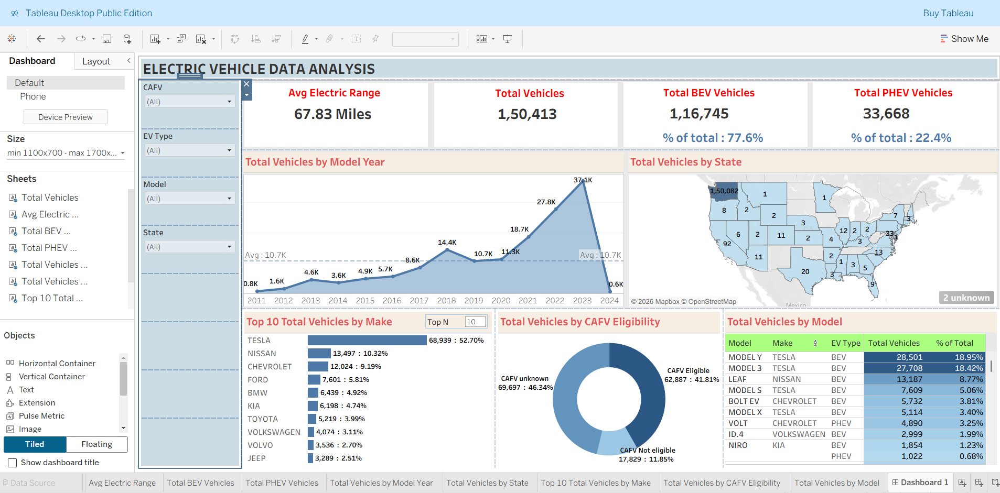

#  Electric Vehicle Data Analysis Dashboard

##  Project Overview

This project is an interactive Tableau dashboard developed to analyze Electric Vehicle (EV) adoption across the United States. The dashboard provides insights into EV growth, manufacturers, vehicle models, CAFV eligibility, and state-wise distribution.

##  Dashboard Preview

##  Objectives

- Analyze yearly EV growth
- Compare Battery Electric Vehicles (BEV) and Plug-in Hybrid Electric Vehicles (PHEV)
- Identify the top EV manufacturers
- Study vehicle model popularity
- Analyze CAFV eligibility
- Visualize state-wise EV registrations

##  Key Performance Indicators (KPIs)

- Average Electric Range
- Total Vehicles
- Total BEV Vehicles
- Total PHEV Vehicles

##  Dashboard Features

- Vehicle Trend by Model Year
- State-wise Vehicle Distribution
- Top 10 Vehicle Manufacturers
- CAFV Eligibility Analysis
- Vehicle Model Comparison
- Interactive Filters

##  Tools Used

- Tableau
- CSV Dataset
- Data Visualization

##  Dataset

The dataset used in this project is publicly available.

**Dataset Link:**

https://drive.google.com/drive/u/0/mobile/folders/1YviyK5J_0LS9yBb2lNh2Fyap1xlyec7W?usp=sharing

Due to its large size, the dataset is not included in this repository.

##  Key Insights

- Tesla is the leading EV manufacturer.
- Battery Electric Vehicles (BEV) account for the majority of EV registrations.
- EV adoption has increased significantly since 2021.
- Model Y and Model 3 are among the most registered EV models.
- Washington State has one of the highest EV registrations.

##  Author

**Kusuma K S**

Artificial intelligence and Data Science Student

GitHub: https://github.com/kusumaks06
